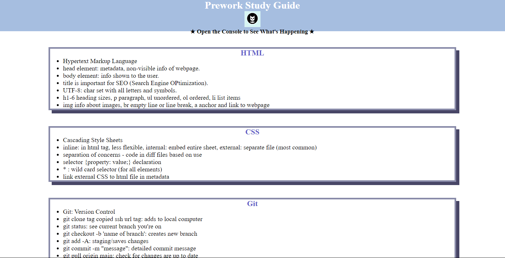
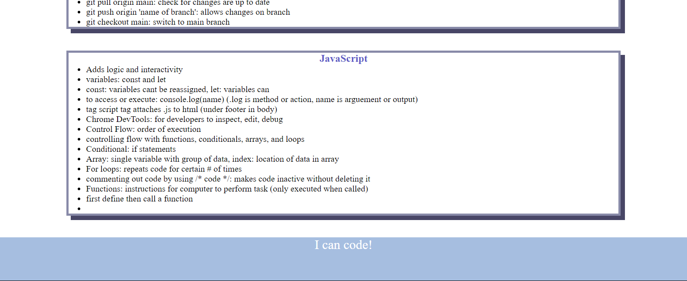

# Mackenzie's Prework Study Guide Webpage

## Description

A study guide for new students learning code that they can refer to for guidance. It has notes on HTML, CSS, Git, and JavaScript. 

## Installation

N/A

## Usage

Review notes in each section. FOr suggestions on what to study first, open the Chrome DevTools by right-clicking and selecting inspect. A console panel will show the list of topcs learned along with a suggestion on which topic to study first.

## Credits

N/A

## License

MIT License (refer to license in the repo)
